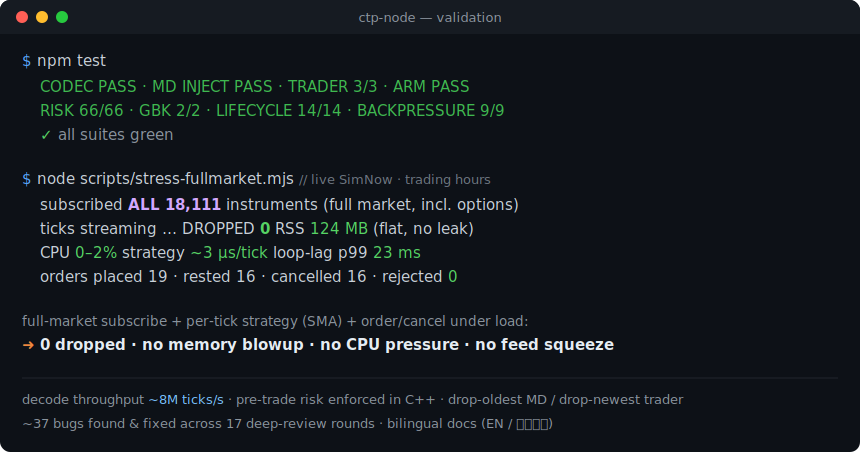

<!-- LANG-SWITCH -->
<p align="right"><a href="README.md">English</a> · <b>简体中文</b></p>

<h1 align="center">ctp-node</h1>

<p align="center">
  <b>面向 Node.js 的高性能、类型安全的 <a href="http://www.sfit.com.cn/">CTP</a>（上期技术）绑定</b><br/>
  用于程序化 / 量化期货交易。
</p>

<p align="center">
  <a href="https://github.com/hitrading/ctp-node/actions/workflows/build.yml"></a>
  <a href="LICENSE"></a>
  
  
  
  
</p>

<p align="center">
  
</p>

- **纯对象、地道的 TypeScript。** 每个 CTP 结构体都是生成的 `interface`，字段为 camelCase（`tick.lastPrice`、`tick.instrumentId`）；每个 CTP 枚举都是真正的 TS `enum`。无手写编解码。
- **快。** CTP 回调线程只把字节 memcpy 进无锁环；JS 直接从环里解码成纯对象，**约 800 万 tick/秒**（相对 5 万/秒的开盘集合竞价突发有 166 倍余量）。
- **混合 API。** 流式推送用 `EventEmitter`（`rtn-depth-market-data`、`rtn-order` 等）+ 请求/响应用 `Promise`（登录、查询、报单），按 request id 关联并支持多行累积。
- **盘前风控在 C++ 中。** 一键熔断、单笔最大手数、最大名义价值、价格偏离（防胖手指）、账户级与按合约的开仓持仓成本上限、按合约的最大持仓（手数、分边）、以及令牌桶限频器，都在原生代码里、报单路径上执行——JS 的 GC 停顿打不垮它们。
- **构造即稳定。** 无手写编解码、threadsafe-function 正确释放、`Init()` 延后以保证 `front-connected` 不丢失、编译器真值（`offsetof`）的二进制布局、GB18030 在 JS 解码（无 Windows 代码页 bug）。

> 面向 CTP 实际支持的范畴（快照驱动、容忍毫秒级的策略：CTA、套利、做市）。真正的微秒级 HFT 在任何语言下都无法通过 CTP 实现。

## 环境要求

Node ≥ 18。Windows/Linux/macOS（x64）提供预编译二进制，多数用户无需编译器。其他平台在安装时从源码构建，需要 C++ 工具链（Windows：VS Build Tools；Linux/macOS：clang/gcc）。CTP 共享库随插件一起打包在旁并自动解析。

## 安装

```sh
npm install ctp-node
```

## 文档

- **完整 API 参考** —— 每一个 TypeScript/JavaScript 接口和方法，含每个参数的类型与含义，以及用法示例：[English](docs/API.md) · [简体中文](docs/API.zh-CN.md)
- 架构与原生内部 —— 无锁数据平面、C++ 风控引擎、背压，以及一次创建的进程生命周期说明：[English](docs/native-hooks.md) · [简体中文](docs/native-hooks.zh-CN.md)
- **故障排查与 FAQ** —— 连接/前置轮换、登录与认证、查询限频、报单被拒、跌停、生命周期、构建问题、CTP 错误码：[English](docs/troubleshooting.md) · [简体中文](docs/troubleshooting.zh-CN.md)

## 快速开始 —— 行情

```ts
import { MarketData } from "ctp-node";

const md = new MarketData("./flow/md/", "tcp://182.254.243.31:30012");

md.on("front-connected", async () => {
  await md.login({ brokerId: "9999", userId: "xxxx", password: "xxxx" });
  md.subscribe(["rb2510", "ag2512"]);
});

md.on("rtn-depth-market-data", (tick) => {
  // tick 是带 camelCase 字段的纯对象
  console.log(tick.instrumentId, tick.lastPrice, tick.bidPrice1, tick.askPrice1);
});
```

## 快速开始 —— 交易

```ts
import { Trader } from "ctp-node";

const td = new Trader("./flow/td/", "tcp://182.254.243.31:30002");

// 盘前风控，在 C++ 中对每笔报单执行：
td.riskSet({ maxOrderVolume: 10, maxOrdersPerSec: 20, maxPriceDeviation: 0.02, maxPositionCost: 5_000_000 });
td.trackMarketData(md); // 为价格偏离校验喂入实时价
td.setMaxPositions({ rb2610: 100, au2610: 10, ru2610: { long: 100, short: 20 } }); // 按合约手数上限
td.setMaxPositionCosts({ ag2608: 2_000_000, au2608: 5_000_000 });                   // 按合约成本上限

td.on("front-connected", async () => {
  // 一站式握手（重连后再调一次）：认证 → 登录 → 确认结算单 → 同步乘数 / 持仓 / 报单。
  // 风控输入自动从 CTP 拉取——无需手动设乘数/播种。
  await td.session({ brokerId, userId, password, appId, authCode });

  // ……或在需要更细控制时手写：
  //   await td.reqAuthenticate({ brokerId, userId, appId, authCode });
  //   await td.reqUserLogin({ brokerId, userId, password });
  //   await td.reqSettlementInfoConfirm({ brokerId, investorId }); // 实盘账户
  //   await td.syncMultipliers(); await td.syncPositions(); await td.syncOrders();

  // 基于 Promise 的查询返回所有行：
  const positions = await td.reqQryInvestorPosition({ brokerId, investorId });

  // 报单走 C++ 风控网关。reqOrderInsert 提交成功即 resolve（CTP 对已接受的报单
  // 不返回 ack）；通过 rtn-order / rtn-trade 跟踪结果。orderRef 留空会自动分配唯一值。
  await td.reqOrderInsert({
    brokerId, investorId, instrumentId: "rb2510",
    direction: "0",            // 见 Direction 枚举
    limitPrice: 3500, volumeTotalOriginal: 1,
  });
});

td.on("rtn-order", (order) => console.log("报单更新", order.orderStatus));
td.on("rtn-trade", (trade) => console.log("已成交", trade.price, trade.volume));

// 应急一键熔断（在 C++ 中立即拦截所有发送）：
// td.halt();  /  td.resume();
```

### 预埋单（延迟攸关）

在市场触及你的触发条件的瞬间从 C++ 发出报单——在行情回调线程上判定，穿过风控网关，**JS 不在回路中**（无事件循环跳转、无 GC 暴露）：

```ts
const armed = trader.arm(md, {
  instrumentId: "rb2510",
  side: "buy",            // buy 在 ask ≤ trigger 时触发；sell 在 bid ≥ trigger 时触发
  triggerPrice: 3500,
  order: {
    brokerId, investorId, instrumentId: "rb2510", direction: "0",
    limitPrice: 3500, volumeTotalOriginal: 1, orderRef: "snipe-1",
  },
});
// 一次性。回执/成交经普通的 rtn-order 事件到达（按 orderRef 匹配）。
// armed.disarm();
```

枚举已导出且带类型：

```ts
import { Direction, OffsetFlag } from "ctp-node";
Direction.Buy;   // "0"
Direction.Sell;  // "1"
```

## API 形态

- `new MarketData(flowPath, fronts)` / `new Trader(flowPath, fronts)` —— `fronts` 是一个 `tcp://` 地址或数组。
- 请求是 camelCase 方法，接受 CTP 字段对象的 `Partial<...>` 并返回 `Promise`。`reqQry*` 以行数组 resolve；多数请求以单条响应行 resolve。
- 发往交易所的 insert/action（`reqOrderInsert`、`reqOrderAction` 等）**提交成功即** resolve —— CTP 对已接受的报单不返回成功响应，只有 `rtn-order` / `rtn-trade`（用 `orderRef` 关联）。只有发送被拒（风控网关、限频、或 CTP API 错误码）才 reject。
- 流式事件用 kebab-case 名称（`rtn-depth-market-data`、`rtn-order` 等）；处理函数收到 `(data, options)`，`options` 带 `{ requestId?, isLast?, rspInfo? }`。
- `client.droppedRecords` 报告背压下丢弃的记录数。行情丢弃**最旧**的未读记录（使你总能看到最新报价）；交易端则丢弃**最新**的，使排队中的报单/成交回报永不被静默丢弃。两者都应监控。
- `client.close()` 释放底层 CTP API。在关闭时调用**一次**——CTP 客户端是一次创建/复用的；靠重建来重连会在厂商 DLL 里死锁（见[生命周期](#生命周期-一次创建并复用)）。

## 生命周期 一次创建并复用

`MarketData` / `Trader` 只创建**一次**并持有到进程结束。CTP 会自行重连；通过在 `front-connected` 再次触发（首次连接 *以及* 每次自动重连都会触发）时原地重跑握手来**原地**处理断线——绝不要销毁再重建客户端。

```ts
const md = new MarketData("./flow/md/", front);
md.on("front-connected", async () => {     // 首次连接和每次重连
  await md.login({ brokerId, userId, password });
  md.subscribe(["rb2510"]);
});
// Trader 同样：原地重跑一站式握手
td.on("front-connected", () => td.session({ brokerId, userId, password, appId, authCode }));
```

> **为什么。** `close()` 调用厂商 `CThostFtdc*Api::Release()`，而 CTP DLL 在一个进程内做几次 `Init()`/`Release()` 循环后会**在 `Release()` 内部死锁**——这是 CTP SDK 本身的限制，不是本绑定的。"reconnect by recreate" 循环会卡死整个进程（且在 Windows 上卡死的进程会忽略 `SIGTERM`，必须用 `taskkill /F` 强杀——在那之前它会锁住 `build\Release\ctp.node`、使下次原生构建失败）。每个客户端只构造一次，且只在关闭时 `close()`。若一个进程内创建/关闭了异常多的客户端，会打印一次性的 `console.warn`（用 `CTP_RECREATE_WARN` 调节/禁用）。详见 [docs/native-hooks.zh-CN.md](docs/native-hooks.zh-CN.md#进程生命周期-一次创建并复用)。

## 架构

```
CTP 回调线程 (C++)                          Node 事件循环 (JS)
  OnRtn.../OnRsp... → memcpy 字节   ──►    合并的门铃 → 整批排空
  进无锁 SPSC 环、                           → 从环里逐条解码
  自增原子索引、敲门铃                          （单态生成的解码器）
  (溢出时：行情丢最旧、                         → 纯对象 → emit / resolve
   交易端丢最新/可靠)
```

公开 API 之下的一切都由 CTP 头文件（`tradeapi/ThostFtdc*.h`）经 `scripts/codegen/` 生成—— 466 个结构体接口、318 个枚举、字段布局表（经 `offsetof`），以及完整的 trader SPI + 请求分发。更新头文件后运行 `npm run gen`。

## 从源码构建

```sh
npm run gen      # 从 CTP 头文件重新生成
npm run build    # gen + 原生 (node-gyp) + tsc
npm test         # 编解码往返 + md + trader（无需网络）
npm run bench    # 解码吞吐
```

## 许可证

Apache-2.0
